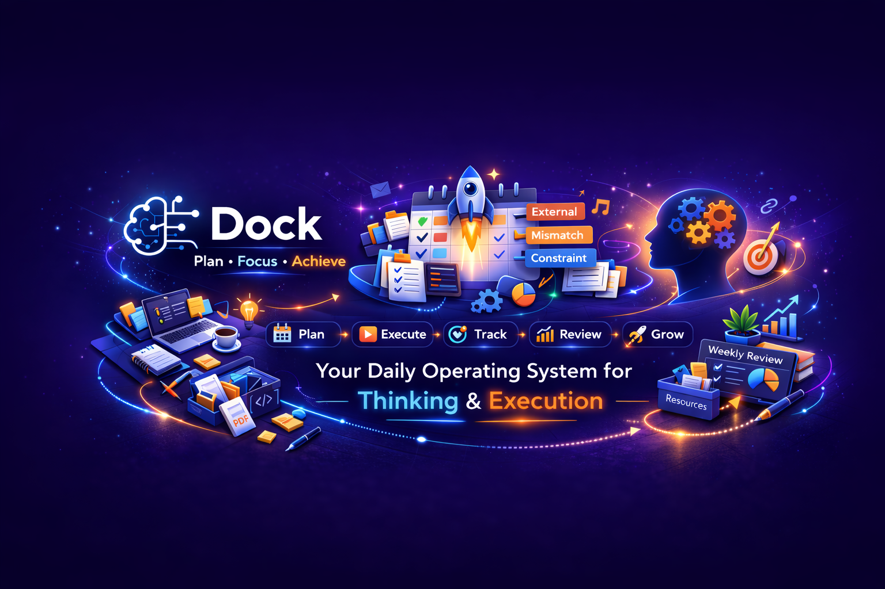

# DOCK



DOCK is a daily operating system for thinking and execution. It connects planning, botherings, routines, deep work, resources, review, and AI into one operating loop.

## Live App

- Web: https://vdock.vercel.app
- Domain: https://dockflow.life

## What DOCK Does

DOCK helps you move from intention to execution:

1. Capture friction with `Botherings`, urges, resistances, rules, and priorities.
2. Connect friction to routines, tasks, and time slots.
3. Execute work inside your daily schedule.
4. Reuse resources, notes, PDFs, and canvases while working.
5. Review misses, progress, and weekly pressure patterns.
6. Feed learning back into strategy, systems, and planning.

## Core Product Areas

- Daily planning and slot-based execution
- Botherings and mindset loop
- Skill growth and deep work tracking
- Resource vault with folders, markdown, code, media, PDF, and canvas
- Weekly review and rebalance
- AI-assisted explanation, rewriting, retrieval, and voice workflows
- Web runtime with Next.js and desktop runtime with Electron

## Desktop Requirements

These are the practical requirements for the full local desktop experience.

### Required for full local desktop stack

- Windows desktop runtime of DOCK
- `Docker Desktop`
- `Ollama`
- At least one Ollama model installed
- Microphone permission for STT

### Required services and default local URLs

- Kokoro local TTS: `http://127.0.0.1:8880`
- Local STT server: `http://127.0.0.1:9890`
- Ollama API: `http://127.0.0.1:11434`

### What each requirement is used for

- `Docker Desktop`
  - runs Kokoro TTS container
  - runs local STT container by default
- `Ollama`
  - powers local AI features when provider is set to `Ollama`
- Ollama model
  - required for local explanation and chat flows
- Microphone permission
  - required for local STT / voice input

### Notes

- Kokoro is desktop-only in the current local setup.
- STT is Docker-first, but can also use a custom local command if configured.
- Ollama is required only if you want local LLM usage. If you use `OpenAI`, you need a valid API key instead.

## Quick Start

### Web development

Install dependencies:

```bash
npm install
```

Run the web app:

```bash
npm run dev
```

### Desktop development

Run desktop app with Next.js + Electron:

```bash
npm run desktop:dev
```

## AI System

AI provider settings support:

- `Ollama`
- `OpenAI`

Configurable items:

- model selection
- provider endpoint
- API key where applicable

AI currently powers:

- PDF explanation
- canvas diagram explanation
- routine rebalance enhancement
- bothering sentence rewriting
- Ask Shiv retrieval and response flow
- TTS and STT integrations

### Shiv V2

- Hybrid retrieval with lexical + local semantic search
- Strict citation mode for app-data answers
- Structured output validation for critical intents
- Observability route and page
- Golden eval quality gate

## Local Desktop AI Setup

## 1. Ollama setup

Install and run Ollama, then pull at least one model.

Check Ollama:

```powershell
ollama --version
curl.exe http://127.0.0.1:11434/api/tags
```

Pull a model:

```powershell
ollama pull gemma3:4b
```

Useful checks:

```powershell
ollama list
ollama ps
```

In DOCK:

1. Open `Settings -> AI Settings`
2. Set provider to `Ollama`
3. Set base URL to `http://127.0.0.1:11434`
4. Select an installed model such as `gemma3:4b`

## 2. Kokoro desktop TTS setup

Use this to enable local read-aloud with Kokoro voices in the desktop app.

### Prerequisites

- Docker Desktop installed and running
- For GPU mode: NVIDIA GPU, recent driver, and Docker GPU support

Checks:

```powershell
docker --version
docker info
docker context show
```

Optional GPU checks:

```powershell
nvidia-smi -L
docker run --rm --gpus all nvidia/cuda:12.4.1-base-ubuntu22.04 nvidia-smi
```

### Pull required images

CPU image:

```powershell
docker pull ghcr.io/remsky/kokoro-fastapi-cpu:latest
```

GPU image:

```powershell
docker pull ghcr.io/remsky/kokoro-fastapi-gpu:latest
```

### Start manually for diagnostics

Remove old container:

```powershell
docker rm -f studio-kokoro-tts
```

Start CPU:

```powershell
docker run -d --name studio-kokoro-tts -p 127.0.0.1:8880:8880 ghcr.io/remsky/kokoro-fastapi-cpu:latest
```

Start GPU:

```powershell
docker run -d --gpus all --name studio-kokoro-tts -p 127.0.0.1:8880:8880 ghcr.io/remsky/kokoro-fastapi-gpu:latest
```

Health and logs:

```powershell
curl.exe http://127.0.0.1:8880/health
docker logs --tail 200 studio-kokoro-tts
```

Expected `/health` response should include `healthy`.

### Use from DOCK desktop

1. Launch desktop app
2. Open `Settings -> AI Settings`
3. Set `Kokoro Local TTS (Desktop only)` to `http://127.0.0.1:8880`
4. Select a `Kokoro_*` voice in supported read-aloud UI
5. Click `Read`

### Kokoro environment controls

```powershell
$env:ELECTRON_KOKORO_FORCE_CPU="1"
$env:ELECTRON_KOKORO_FORCE_GPU="1"
$env:ELECTRON_KOKORO_AUTO_START="0"
$env:ELECTRON_KOKORO_BASE_URL="http://127.0.0.1:8880"
```

### Common Kokoro failures

- `failed to connect to the docker API at npipe:////./pipe/dockerDesktopLinuxEngine`
  - Docker Desktop is not running
- `health check timeout`
  - container started but model init is still in progress
- TTS API returns `500`
  - Kokoro URL is wrong or service is unhealthy

Quick diagnostics:

```powershell
docker ps -a --filter "name=studio-kokoro-tts"
docker inspect studio-kokoro-tts --format "{{.State.Status}}"
docker logs --tail 200 studio-kokoro-tts
curl.exe http://127.0.0.1:8880/health
```

## 3. Local STT setup

Shiv mic input is local-first and works with a local STT server.

### Prerequisites

- Docker Desktop installed and running
- At least 4 GB free RAM for smaller models
- Microphone permission enabled

Checks:

```powershell
docker --version
docker info
docker context show
```

### Pull required image

```powershell
docker pull onerahmet/openai-whisper-asr-webservice:latest
```

### Start manually for diagnostics

Remove old container:

```powershell
docker rm -f studio-local-stt
```

Start CPU baseline:

```powershell
docker run -d --name studio-local-stt -p 127.0.0.1:9890:9000 -e ASR_MODEL=base.en -e ASR_ENGINE=openai_whisper onerahmet/openai-whisper-asr-webservice:latest
```

Start faster-whisper mode:

```powershell
docker run -d --name studio-local-stt -p 127.0.0.1:9890:9000 -e ASR_MODEL=base.en -e ASR_ENGINE=faster_whisper onerahmet/openai-whisper-asr-webservice:latest
```

Health and logs:

```powershell
docker ps -a --filter "name=studio-local-stt"
docker logs --tail 200 studio-local-stt
curl.exe -X POST "http://127.0.0.1:9890/asr?output=json" -F "audio_file=@C:\Windows\Media\ding.wav" -F "task=transcribe" -F "language=en"
```

### Use from DOCK desktop

1. Launch desktop app
2. Open `Settings -> AI Settings`
3. Set `Local STT Server URL` to `http://127.0.0.1:9890`
4. Open Ask Shiv and click mic
5. Verify status shows local STT running

DOCK STT route auto-tries:

- `/transcribe`
- `/v1/audio/transcriptions`
- `/asr`

### STT environment controls

```powershell
$env:ELECTRON_STT_AUTO_START="0"
$env:LOCAL_STT_BASE_URL="http://127.0.0.1:9890"
$env:ELECTRON_STT_DOCKER_IMAGE="onerahmet/openai-whisper-asr-webservice:latest"
$env:ELECTRON_STT_MODEL="base.en"
$env:ELECTRON_STT_START_COMMAND="your_stt_server_command_using_$env:STT_PORT"
```

### Common STT failures

- `offline`
  - STT service is not running yet
- `404`
  - wrong base URL or wrong endpoint path
- `500`
  - backend crashed or model missing
- empty transcript
  - noisy audio, denied mic permission, or server returned empty text

Quick diagnostics:

```powershell
docker ps -a --filter "name=studio-local-stt"
docker inspect studio-local-stt --format "{{.State.Status}}"
docker logs --tail 200 studio-local-stt
curl.exe -X POST "http://127.0.0.1:9890/asr?output=json" -F "audio_file=@C:\Windows\Media\ding.wav" -F "task=transcribe" -F "language=en"
```

### STT request compatibility

DOCK sends multipart form-data with:

- audio fields: `audio`, `file`, `audio_file`
- optional hints: `task=transcribe`, `language=en`, `output=json`, `temperature=0`, `best_of=5`, `beam_size=5`

## Production Builds

Web build:

```bash
npm run build
npm run start
```

Desktop distributable:

```bash
npm run desktop:dist
```

Desktop packaging notes:

- uses bundled local Next server for runtime
- supports optional startup URL fallback with `ELECTRON_START_URL`
- to force desktop to use hosted web origin:
  - `ELECTRON_START_URL=https://vdock.vercel.app`
  - `ELECTRON_FORCE_REMOTE=1`
- to keep local desktop runtime but use hosted auth APIs:
  - `ELECTRON_AUTH_BASE_URL=https://vdock.vercel.app`

## Data and Sync

- App state is auto-persisted per user
- Export/import JSON backup is supported
- Sync-related settings are configurable in app settings
- Secrets and provider keys depend on runtime and provider choice

## Repository Structure

- `src/app/*` route pages and API routes
- `src/components/*` UI modules and panels
- `src/contexts/AuthContext.tsx` central app state and actions
- `src/lib/*` AI, storage, and utility logic
- `src/types/*` shared types
- `electron/*` desktop runtime scripts

## Scripts

- `npm run dev` web development server
- `npm run build` production web build
- `npm run start` run production build
- `npm run typecheck` TypeScript no-emit checks
- `npm run desktop:dev` desktop development runtime
- `npm run desktop:build` desktop Next build target
- `npm run desktop:dist` desktop installer build
